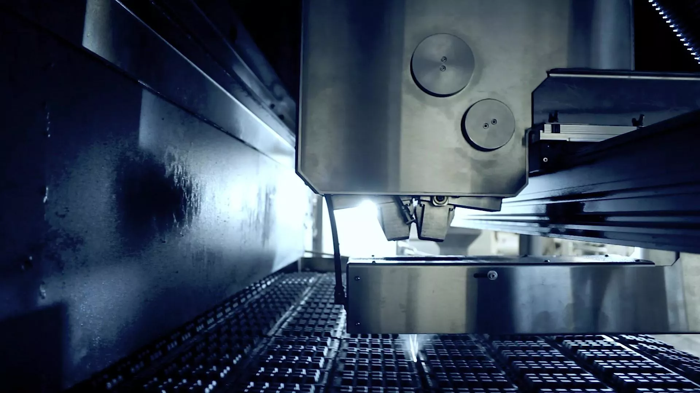
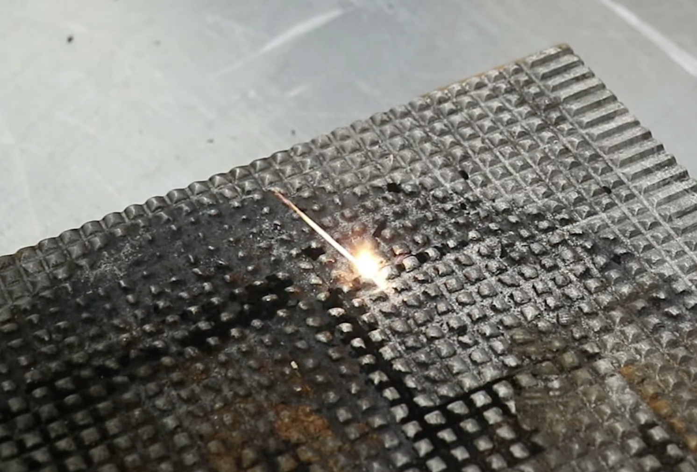
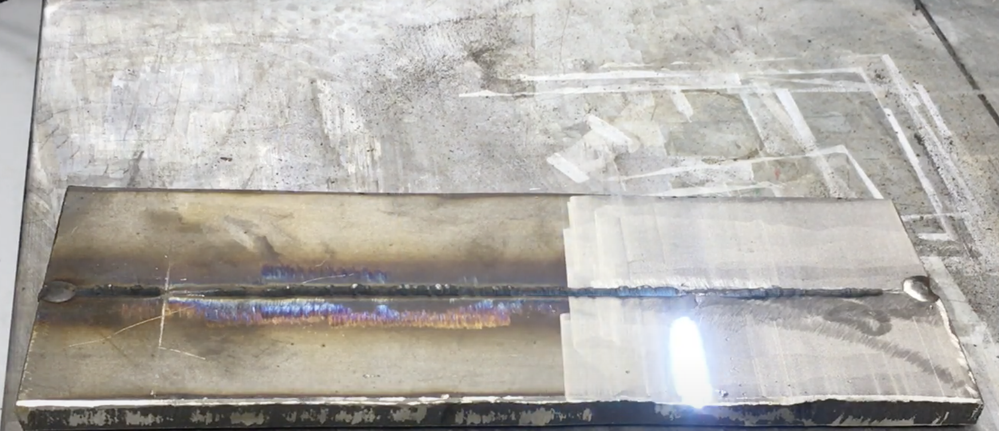
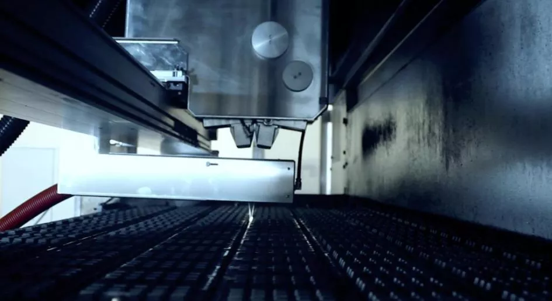

# 7 причин использовать P-Clean на пищевом предприятии

> Здесь представлен образец статьи о возможностях применения системы лазерной очистки на пищевых предприятиях. Основная целевая аудитория статьи — технические специалисты и руководители пищевых предприятий. Статья написана таким образом, чтобы человек, при желании, мог прочитать только подзаголовки и плашки.

Технология лазерной очистки активно внедряется в сфере пищевой промышленности. Это связано с высокой скоростью и эффективностью очистки, отсутствием побочных загрязнений и дополнительных затрат на расходные материалы. В этой статье коротко расскажем о главных преимуществах лазерного комплекса P-Clean.

## Очистка без остановки конвейера

Традиционные методы очистки требуют частичной остановки процесса  пищевого производства. Перед очисткой поверхность должна остыть, после обработки ее надо снова разогревать. Зачастую, процесс полной очистки занимает не один день. Простой оборудования — это упущенная прибыль.

>**Преимущество P-Clean:**
>
>Не зависит от температуры обрабатываемой поверхности, не требует остановки конвейера.

## Удаление стойких загрязнений

Полимеризованное масло — одно из самых сложных загрязнений на пищевом производстве  в плане очистки. Его практически невозможно удалить механически и сложно растворить с помощью химических реагентов.

>**Преимущество P-Clean:**
>
>Удаляет любой вид загрязнений, в том числе: пригоревшие частицы пищевых продуктов, нагары, полимеризованное масло.

*Пример удаления пищевых остатков с металлической формы на молочном производстве с помощью  P-Clean*

## Никакой грязи и дополнительных трат

Традиционные способы очистки требуют использования расходных материалов: щетки, абразив, химические реагенты. После обработки рабочих поверхностей необходимо проводить дополнительную уборку абразива и оставшейся грязи. Химические отходы необходимо правильно утилизировать.

>**Преимущество P-Clean:**
>
>Отсутствие побочных продуктов. Большинство очищаемых загрязнений испаряются. Не нужна дополнительная обработка помещения и отходов. Единственные расходы — электроэнергия из расчета 1 кВт на 1м² очищаемой поверхности.  

## Без повреждения поверхности

Регулярная механическая очистка со временем приводит к деформации поверхности, изменению ее рельефа и как итог — браку пищевой продукции.

>**Преимущество P-Clean:**
>
>Лазерное излучение воздействует только на слой загрязнения без повреждения основной поверхности.

*Лазерная очистка подовой плиты от следов ржавчины и нагара*

## Локальная очистка для ремонта

Оборудование периодически выходит из строя. Необходим ремонт устройств. Для этого требуется локально зачистить элементы оборудования: удалить ржавчину, жировые загрязнения и краску с корпуса. При использовании традиционных методов очистки увеличивается время ремонта оборудования.

>**Преимущество P-Clean:**
>
>Точность позиционирования лазерного излучения позволяет локально удалить слой краски или загрязнений в кратчайшие сроки.

## Обработка сварных швов

При производстве пищевого оборудования и посуды, а также ремонте  необходимо проводить сварочные работы. Требуется подготовить поверхность к сварке: удалить загрязнения и ржавчину, чтобы обеспечить надежное сварное соединение. После сварки требуется постобработка, чтобы удалить цвета побежалости и оксидные пленки.

>**Преимущество P-Clean:**
>
>Быстрая подготовка поверхностей к сварочным работам. Качественная очистка, которая обеспечивает надежное сварное соединение. Восстановление внешнего вида поверхности после сварки и устранение цветов побежалости.

*Лазерная очистка сварного шва от цветов побежалости*

## Автоматизация процессов

Компания PLasers занимается разработкой индивидуальных автоматизированных лазерных систем. Автоматическая лазерная очистка — это сочетание эффективности лазерной технологии и роботизированной системы. Робот выполняет работу и контролирует качество результата самостоятельно.

Наши специалисты разработают роботизированный комплекс под ваши производственные задачи, выполнят монтаж и интеграцию системы в производство.

>**Основные преимущества автоматизированной системы:**
>
>- Увеличение производительности;
>- Работа без остановки производства 24/7;
>- Простое управление;
>- Передовые технологии;
>- Повышенная точность обработки.

*Автомазированная система лазерной очистки подовых плит*

*Посмотреть [оригинал статьи](https://docs.google.com/document/d/1HIKktFdVjWBz25EP9OYj7N-wPp-xV2SvATSXIEhgNac/edit?usp=sharing) в GoogleDoc.*
