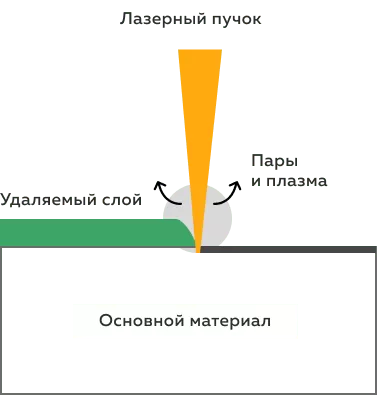
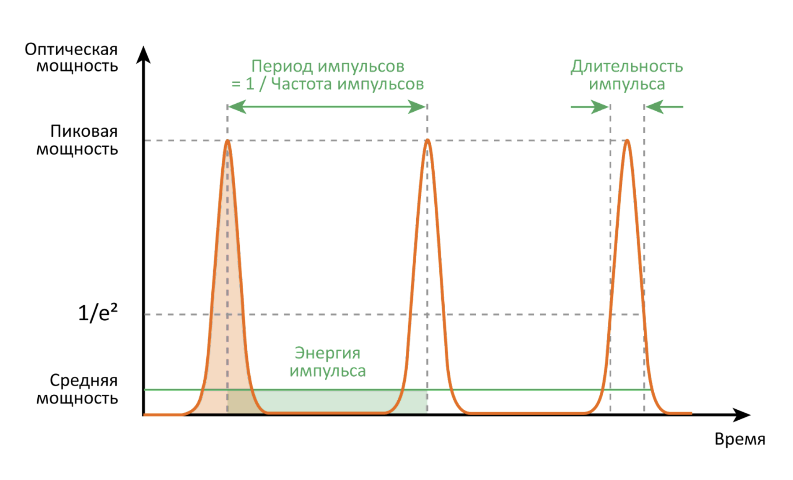

# Технология лазерной очистки

>Здесь представлен пример статьи, которая рассказывает как устроена работа лазерного оборудования для очистки поверхностей, а также какие требования предъявляются к условиям его эксплуатации.

## Как лазер воздействует на загрязнения

Лазер накапливает энергию и выпускает её на загрязненный участок порциями. Энергия в импульсе примерно в 100 раз выше, чем средняя мощность лазера. Такая значительная энергия создает в локальной области на поверхности микровзрывы, которые разрушают структуру загрязнения за счет ударной волны. Происходит удаление загрязнения: большая его часть испаряется, а остатки рассеиваются в виде незначительной пыли. Остальная часть поверхности не успевает нагреться и деформироваться за короткое время импульса. 

*Схема лазерной очистки*

*График импульсного лазерного излучения*

## Что нужно для работы?

Одним из преимуществ лазерной очистки являются минимальные требования для работы лазерных систем. Для эффективной очистки важно соблюсти несколько условий: 

- Помещение должно быть проветриваемым;
- Необходима вытяжка, чтобы удалять продукты горения;
- Температура от 0 до +35;
- Влажность воздуха до 80%.
